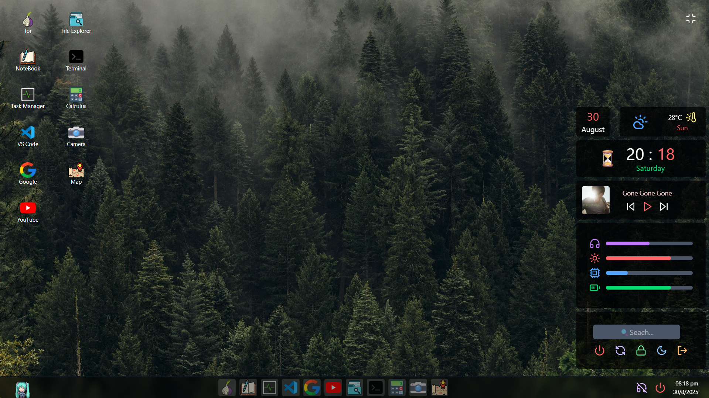

# VoidOS — A Browser-Based Operating System Simulator

VoidOS is a fully interactive desktop-like operating system simulator built entirely using ReactJS. It mimics the look and feel of a real OS inside your browser, featuring animated UI components, windowed applications, and so many intractive apps.




## Features

- **Desktop Environment:** Main workspace with icons and wallpaper, supports drag-and-drop windows and launching apps.
- **Taskbar:** Displays running apps, quick launch, and system controls for easy navigation.
- **Windowed Applications:** Each app opens in a movable window with minimize, maximize, and close buttons for multitasking.
- **Widgets:** Includes media player (play songs), date & time display, and power controls (shutdown/restart) for quick access to essential functions.
- **Animated UI:** Smooth transitions and modern design for an engaging user experience.
- **Terminal Emulator:** Simulated command-line interface for running system-like commands.
- **Context System:** Global state management for seamless system behavior and app communication.

### Built-in Apps

- **Browser:** A working browser (but only show sites which allow iframe).
- **File Explorer:** Browse, open, and manage files and folders.
- **YouTube:** A mini youtube where you can watch videos like them and track history.
- **Task Manager:** View and manage running apps and system resources.
- **VSCode:** It's a lite version of VSCode which only support html/css/js.
- **Notebook:** Take notes just like Notepad write anything.
- **Terminal:** Run simulated commands.
- **Camera:** Access and preview your webcam feed.
- **Calculator:** Perform basic arithmetic operations.
- **Google:** Embedded Google search and browsing.
- **Map:** View and interact with google maps.

## Getting Started

### Installation

```bash
git clone https://github.com/BNB2006/VoidOS-2.0.git
cd VoidOS-2.0
npm install
```

### Running the App

```bash
npm run dev
```

Open your browser and navigate to `http://localhost:5173` (or the port shown in your terminal).

## Technologies Used

- ReactJS
- Vite
- Tailwind css

## License

This project is licensed under the MIT License.